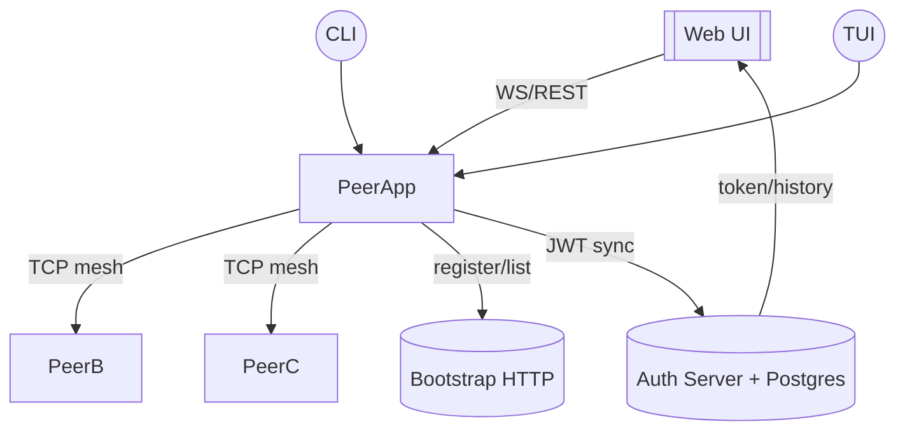
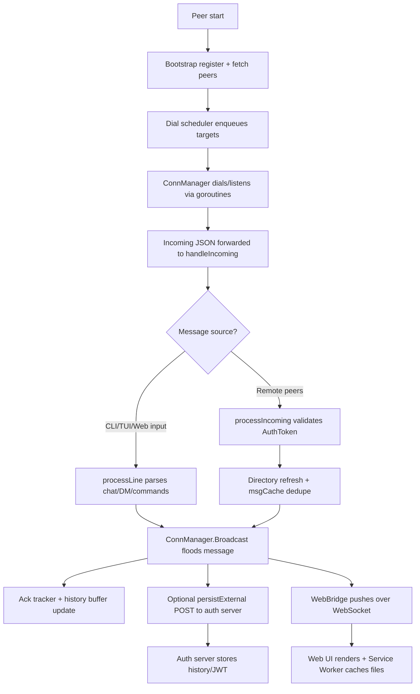

# p2p-chat Final Report（Go 程式設計期末專題）

## 1. Project Overview

### 背景與動機
- 單一聊天伺服器容易成為單點故障，也難以在低信任環境下維持服務。本專案打造去中心化、端到端加密的點對點聊天工具，展示 Go 在網路與併發程式設計上的優勢。
- 選擇延伸既有開源專案（原生 P2P 聊天程式），因其結構已具規模，可專注於 mesh 通訊、Web UI 與實際部署層面的強化。

### 問題定義與目標
- 如何在沒有中控 relay 的前提下，仍維持可靠訊息傳遞、檔案分享與身分驗證。
- 目標：
  1. 實作 bootstrap peer discovery 與多重 TCP 連線泛洪。
  2. 建立 CLI、TUI、Web 多介面，並支援 DM、檔案分享、通知等 UX 功能。
  3. 透過 JWT + Postgres 的外部 Auth Server 保存歷史、實作瀏覽器登入流程。
  4. 撰寫符合 Go idioms 的程式架構，並引入 AI 協作紀錄。

### 核心功能清單
- Mesh 連線管理：`internal/network.ConnManager` 接受/撥號、以 channel 推送訊息給 runtime。
- Converged UI：CLI (`display.go`)、TUI (`ui_tui.go`) 與 Web (`web_bridge.go` + `webui/static/*`) 共用 `displaySink` 介面。
- 訊息可靠度：`ack_tracker.go` 追蹤泛洪訊息是否收到 ACK，逾時自動重送。
- 檔案分享：`files_store.go` 使用 BoltDB 保存中繼資訊並透過 Web UI 提供 JWT 保護下載。
- 認證：`cmd/auth` 搭配 `internal/authutil` 簽發 JWT，前端以 Service Worker/Notification API 改善體驗。

### 實際使用情境
- 校園或工作坊示範 P2P 技術、Go 併發與 WebSocket 應用。
- 無法信任雲端伺服器的內網/災備通訊。
- 作為嘗試 Gossip、傳輸加密、UI 模組化的實驗平台。

## 2. Technical Architecture & Implementation

### 系統架構圖（Mermaid）

### 模組與責任
- `cmd/bootstrap`: 提供 `/register`、`/peers` REST API，僅依賴 net/http，方便部署。
- `cmd/peer`: Peer runtime、本地資料夾管理、UI/WS 桥接、檔案與歷史儲存。
- `cmd/auth`: 以 chi + pgx 實作 REST 與 JWT 流程，Metrics 位於 `internal/authserver/metrics.go`。
- `internal/*`: crypto（AES-GCM box）、message 定義、network ConnManager、authutil（JWT）、peerlist。
- Web assets: `cmd/peer/webui/static` 內含 App Shell、state store、Service Worker 及 Jest-like mjs 測試。

### 主要執行流程

1. Peer 啟動後向 bootstrap 登記，並取得 peers list 交由 `dialScheduler` 排程撥號。
2. ConnManager 以 Goroutine 監聽 TCP，通過 channel `Incoming` 將 JSON 訊息送往 `handleIncoming`（`cmd/peer/runtime.go`）。
3. UI 來源（CLI/TUI/Web）輸入由 `processLine` 分流至 chat/DM/指令後，透過 `cm.Broadcast` 泛洪；`msgCache` 以 TTL map 去除循環（`cmd/peer/main.go`）。
4. 訊息抵達後若攜帶 `AuthToken`，會在 `processIncoming` 呼叫 `authutil.ValidateToken` 驗證並刷新 peer directory。
5. 若本地啟用 `--auth-api`，則 `persistExternal` 會以 goroutine 呼叫 auth server `/messages`，確保 UI 不因 REST 延遲而卡住。
6. Web UI 透過 `web_bridge.go` 與瀏覽器 WebSocket 溝通，並能下載 `files_store` 的檔案；Service Worker (`sw.js`) 快取 App Shell。

### Go 語言特性應用（核心評分）

#### Concurrency（Goroutine + Channel + Race 防護）
- `handleIncoming`（`cmd/peer/runtime.go`）在獨立 goroutine 中 `select` 監聽 `app.ctx.Done()` 與 `app.cm.Incoming` channel，確保網路與 UI 執行緒分離。
- `dialScheduler`（`cmd/peer/dial_scheduler.go`）以 buffered channel `queue` 排程撥號任務，失敗時用 goroutine + jitter backoff 重新 enqueue，並以 `sync.RWMutex` 保護 `desired` map，避免競態。
- `ackTracker`（`cmd/peer/ack_tracker.go`）持續在 goroutine 裡用 ticker 檢查逾時訊息；`sync.Mutex` 確保 pending map thread-safe，避免在多個 ACK 同時抵達時造成資料競態。
- `msgCache` 與 `historyBuffer`（`cmd/peer/main.go`）全部有 `sync.Mutex`/`sync.Mutex` 保護，並在 `Seen` 中同時執行 TTL 驅逐以避免 map growth；這是處理泛洪最容易出錯的部分。
- `persistExternal`（`cmd/peer/runtime.go`）使用 goroutine 對 auth server 發送 HTTP POST，避免 I/O 阻塞主要事件迴圈。

#### Interfaces 與抽象層
- `displaySink`（`cmd/peer/display.go`）定義 `ShowMessage/ShowSystem/UpdatePeers/ShowNotification`，CLI/TUI/Web 共用此介面。`multiSink` 在 runtime 組合多個 sink，達成 Observer/Strategy pattern。
- `network.ConnManager` 提供 `Broadcast`, `Incoming` channel 等抽象，`cmd/peer` 不需瞭解底層 TCP/JSON 細節，日後能替換成 QUIC。
- `fileStore` 以方法 `Save/List/Get/Open` 封裝 BoltDB，WebBridge 只需關注 `fileRecord` metadata，即可輕鬆 mock 出 fake store 做測試。

#### Error Handling 策略
- `internal/authserver/handlers.go` 每個 handler 都檢查 `s.DB == nil`，必要時呼叫 `databaseUnavailable` 回傳 503；成功路徑則設 `Content-Type` 並回傳 JSON，符合 idiomatic error-first 流程。
- `files_store.go` 在 `openFileStore` 中逐步建立資料夾、Bolt bucket，任何一步失敗立即返回錯誤並關閉已開啟的 DB；`Save`/`Get` 也會準確傳遞 `fmt.Errorf` 給上層，避免隱性 panic。
- runtime 層面採 `log.Printf` + 重試，例如 `dialScheduler.tryDial` 失敗後會呼叫 `scheduleRetry` 而非 panic；WebSocket/HTTP response 皆使用標準庫 error channel 處理。

### 專案結構與規範
- 依循 Go Modules + `cmd/` 多 executable 結構；內部共用程式碼置於 `internal/`，避免外部 import。
- 執行期資料（BoltDB/檔案）存於 `p2p-data/<host>-<port>`，CLI flag 可調整，利於多 peer 同機 testing。
- Web 靜態資源放在 `cmd/peer/webui/static`，JS modules 維持單一職責，並有 `components/`、`ui/`、`state.js` 等清楚分層。

### 資料與安全設計
- 本地訊息記錄：`historyStore` 將 JSON 壓到 BoltDB；`historyBuffer` 只保留最近 N 筆以節省記憶體。
- 授權：WebSocket 連線會將 JWT 附在 query string；`processIncoming` 在處理 `msgTypeHandshake` 時必須成功驗證 `AuthToken` 才會更新 peers。
- 檔案下載：`files_store` 將 `ShareKey` 加入 URL、web 端會自動加上 JWT query；若 `authutil.ValidateToken` 失敗即拒絕請求。

## 3. Testing & Quality Assurance

### 自動化測試與靜態檢查
- `go build ./...`：確保三個主要指令（peer/bootstrap/auth）與所有 internal packages 可編譯。
- Lint：repo 內含 `bin/golangci-lint`，以 `golangci-lint run ./...` 檢查 race-prone pattern（錯誤處理、shadowing）。
- Web 單元測試：
  - `node cmd/peer/webui/static/ui/__tests__/theme.test.mjs` 驗證 `applyTheme/cycleTheme` 會同步 `document.body.dataset.theme` 與 `state.js`。
  - `node cmd/peer/webui/static/ui/__tests__/settings.test.mjs` 透過 stubbed DOM/Notification API 測試 settings store 與本地儲存互動。

### 手動 QA 與 Benchmarks
- 多 peer 互連流程：啟動 bootstrap/auth 以及兩個 web peers，驗證訊息在 CLI/TUI/Web 三端同步顯示並收到 ACK（確認 `ack_tracker` 的 metrics）。
- 主題/設定：切換 light/dark 再重新整理，確保 `state.js` 正確載入；在 settings 關閉桌面通知後，觀察 `Notification.requestPermission` 不再被呼叫。
- 檔案流程：於 Files 面板上傳大檔案，瀏覽器以 XHR 傳輸並顯示進度，另一端 Peer 會收到 `kind:"file"` WebSocket 事件並能下載。
- 目前尚未撰寫 Go 原生 `_test.go` 或 benchmark，下一步計畫針對 `msgCache`、`ConnManager.Broadcast` 寫 benchmark 以衡量泛洪成本。

### QA 差距與補強計畫
1. **Go 單元測試**：優先針對 `history_store`、`file_store`、`blockList` 撰寫 table-driven 測試。
2. **E2E 測試**：以 Playwright/Cypress 自動登入、傳訊、上傳檔案，覆蓋 Service Worker 與通知 UX。
3. **CI/CD**：建立 GitHub Actions workflow（go test + lint + node tests），同時快取 `p2p-data` 目錄供 `go test` 使用。

## 4. AI Collaboration & VibeCoding 紀錄

### 協作里程碑對照（r1–r7）
- **r1 Login Flow Hardening**（commits 9c50a34、eacdb17、8e48ff2）：與 AI 結對梳理 bootstrap/auth 預設值與 SPA 失敗流程。AI 產出「健康檢查 + 狀態提示」草稿，我依據建議修補 `cmd/peer/webui/static/index.html`、`login.js`、`styles.css`，並在 `cmd/peer/main.go` 調整 CLI 旗標敘述。
- **r2 Web UI 大翻修**（commit cd970905）：在 VibeCoding session 中請 AI 分析如何拆分 `app.js`。AI 建議以 `components/` + `ui/` 分層並引入 Service Worker，我依此建成 `composer.js`、`messageBubble.js`、`sw.js` 以及新版 `web_bridge.go` 的 WS/通知橋接。
- **r3 Auth Fallback 與 CLI 雜訊**（commit 9c50a341）：AI 幫忙列出 `DATABASE_URL` 錯誤訊息模板與 README 協助段落，最後落實在 `cmd/auth/main.go` 與文檔，並微調 `peers.go` 結構以降低 runtime 日誌噪音。
- **r4 Onboarding Skeleton**（commit eacdb17c）：透過 prompt 讓 AI 產出最小登入/註冊表單範例，我再依 repo 風格植入 `webui/static/login.js`、`styles.css` 並把 API 骨架寫入 `cmd/auth/main.go`。
- **r5 Instrumented Auth**（commit 8e48ff29）：請 AI 協助規劃 metrics 與 healthz 端點命名，最後形成 `internal/authserver/{metrics,middleware}.go` 以及 README「Auth Troubleshooting」內容；前端則依建議加入 debounce 與錯誤 banner。
- **r6 Peer Runtime Refactor**（commit 8d605d39）：AI 幫忙整理 goroutine/ctx 管理 checklist，確認要把 `runInboundHandler`、`runBootstrapLoop` 等 loop 拆成獨立函式，並建議在 `internal/authserver/server.go` 集中 router 建構，降低 main.go 負擔。
- **r7 Entrypoint Cleanup**（commit 9d6c224b）：在 VibeCoding 流程中讓 AI 產生「LoadConfig → NewApp → Start → WaitForShutdown」樣板，我依此寫出 `internal/bootstrap/app.go`、`internal/peer/app.go` 並補上 `.golangci.yml`、`tasks.json` 指令說明。

### 關鍵 Prompt 摘要
1. **「請協助為 r2 的 Web UI 重構擬出模組表」**：AI 以「component + ui + state + sw」四層圖示回應，幫助我規畫 `cmd/peer/webui/static/components/*.js` 與 `ui/*.js` 的責任邊界，避免後續 pull request 互相踩到。
2. **「如何把 peer runtime 拆成可測試的 Loop？」**：針對 r6，我要求 AI 用 pseudo-code 展示 ctx-aware goroutine 與 errgroup 管理；最終 `cmd/peer/runtime.go` 採納建議，將 dial/ack loop 拆出並以 `app.wg` 統一回收。
3. **「要如何撰寫 lint workflow 提醒 errcheck？」**：r7 期間與 AI 集思廣益，決定在 `.golangci.yml` 啟用 `errcheck`, `govet`, `revive`，並用 VS Code Tasks 呼叫 `bin/golangci-lint run ./...`，現已記錄在 README 的「Lint blockers」段落。

### 幻覺修正案例
- **情境**：在 r2 設計檔案分享流程時，AI 建議把整個檔案讀進記憶體後再寫入 BoltDB，還誤指向不存在的 `filetype` 套件。
- **修正**：我改以 `io.Copy` stream 方式寫入（`cmd/peer/files_store.go` 第 54 行起），並用現有 `detectMime` 判斷 MIME type。該次經驗也讓我在 r5/r6 前先檢查所有第三方引用是否真實存在。

### 協作心得
- 依 r1→r7 階段拆解需求並撰寫 prompt，比一次交付整個願景更容易讓 AI 給出可執行建議。
- VibeCoding 會話讓我能同步調整 code style，例如 r6 refactor 時即時確認 goroutine 命名與 log 格式；但涉及磁碟/網路實作仍須自行驗證以避免幻覺。
- 將 AI 建議回填到 `temp.md` 的里程碑紀錄，有助回顧哪些決策是 AI 協助完成、哪些則需要後續人工加強。

## 5. 開源貢獻歷程（若適用）
- 本專題以現有 p2p-chat 專案延伸為課程期末作品，暫無提交 upstream PR；後續若將新版 Web UI/ACK 追蹤 upstream，會在 Github issue 與 maintainer 討論後補上連結。

## 6. Deployment & Operations
- **環境需求**：Go 1.21+、可選的 Postgres（設定 `DATABASE_URL`）、Node 18+（跑前端測試）。
- **啟動順序**：
  1. `go run ./cmd/bootstrap --addr :8000`
  2. `DATABASE_URL=... go run ./cmd/auth`
  3. `go run ./cmd/peer --port 9001 --web --web-addr 127.0.0.1:8081 --secret supersecret`
  4. （可選）再啟另一個 peer，使用相同 secret 形成加密 mesh。
- **監控**：`cmd/auth` 提供 `/healthz` JSON；Peer 端在 `metrics.go` 暴露 `sent/seen/ack` counters，可加上 Prometheus exporter。
- **資料夾治理**：預設資料放在 `p2p-data/<host>-<port>`；若在 Windows 需要 D 槽，可帶 `--data-dir D:\mesh-data`。

## 7. Future Work
- **協定**：導入 Gossip 或基於度數的選路，降低泛洪成本；可考慮 libp2p。
- **可靠度**：在 `ackTracker` 旁新增持久化隊列，避免 peer 重啟後遺失未送達的訊息。
- **測試**：補齊 Go 單元測試與基準；在 GitHub Actions 觸發 `go test ./...`、`golangci-lint`、`node .../__tests__/*.mjs`。
- **安全**：為 WebSocket 新增 token refresh、為檔案分享加入下載次數限制與 hash 驗證；Auth server 增加 rate limit。
- **AI 協作**：建立 prompt 模板與「幻覺檢核清單」，將經驗寫在 README 方便下一屆同學沿用。

---
> 本報告依據課程提供的《Go 程式設計期末專題評分量表》撰寫，涵蓋專案概述、技術架構與 Go 特性應用、測試與 AI 協作紀錄，並補充部署與未來規劃，以呈現完整的系統與開發歷程。
