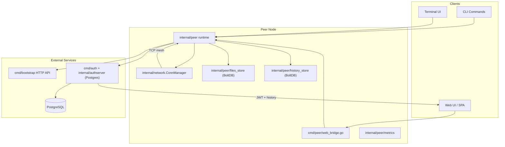
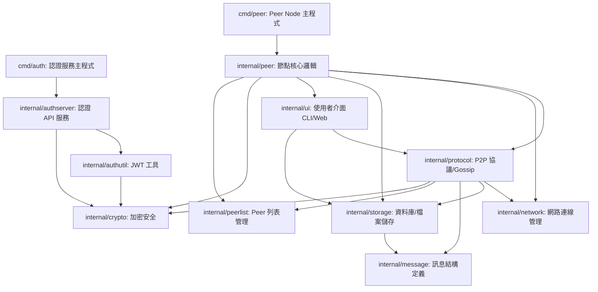

# p2p-chat Architecture

## High-Level Diagram

## Module Responsibilities & Dependencies

- **cmd/bootstrap**

  - Provides `/register` and `/peers` endpoints for discovery; wraps `internal/bootstrap/app`, `config`, and `handlers`.
  - Depends on standard `net/http`, `internal/peerlist` for in-memory registry, and shared configuration helpers.
  - Consumed by peer nodes during startup and periodic refresh.
- **cmd/auth**

  - Entry point for the authentication service; wires environment/flags, logging, and database connectivity.
  - Delegates HTTP construction to `internal/authserver/server.go`, which mounts middleware, handlers, and metrics.
  - Depends on `internal/authutil` for JWT signing/validation and on PostgreSQL (via `pgx`) for persistence.
  - Exposes `/login`, `/register`, `/messages`, `/healthz`, and metric endpoints consumed by peers and Web UI.
- **cmd/peer**

  - Thin CLI wrapper that loads `internal/peer/config`, instantiates `peer.App`, then starts runtime loops.
  - Consumes most internal packages: `internal/peer/*` (runtime, ui bridge, file/history store, ack tracker, dial scheduler, metrics), `internal/network`, `internal/message`, `internal/authutil`, and `internal/crypto`.
  - Spawns optional surfaces (CLI, TUI, Web) and binds to local BoltDB directories under `p2p-data/`.
- **internal/bootstrap**

  - Shared code used by the bootstrap binary: configuration parsing, graceful shutdown scaffolding, and HTTP handlers.
  - Depends on `internal/peerlist` data structures and standard library concurrency primitives.
- **internal/authserver**

  - Houses the auth service implementation (handlers, middleware, metrics, server bootstrap).
  - Depends on `internal/authutil` (JWT), `internal/message` (shared DTOs), database interfaces, logging, and chi router.
  - Emits Prometheus-style metrics and wraps recover/logging middleware for all auth routes.
- **internal/authutil**

  - Stateless helper for generating and validating JWTs; used by both `cmd/auth` and `cmd/peer`.
  - Depends on `github.com/golang-jwt/jwt/v5` plus standard crypto helpers.
- **internal/crypto**

  - Provides secure random helpers and AES-GCM utilities for message encryption, key derivation, and secret handling inside peers.
  - Used by `internal/peer` runtime and networking components.
- **internal/message**

  - Defines the canonical message schema (chat, file, control) and helper functions for encoding/decoding.
  - Shared across peer runtime, auth server (history ingestion), and Bootstrap interactions.
- **internal/network**

  - Implements `ConnManager`, handling TCP listeners, outbound dialing, message marshaling, and broadcast fan-out.
  - Consumes `internal/message` for serialization and is controlled by `internal/peer/runtime` via channels.
- **internal/peer**

  - Largest package: runtime orchestration (`runtime.go`), UI sinks (`display.go`, `ui_cli.go`, `ui_tui.go`, `web_bridge.go`), reliability helpers (`ack_tracker.go`, `dial_scheduler.go`), storage (`files_store.go`, `history_store.go`), metrics, and peer directory/state.
  - Depends on `internal/message`, `internal/network`, `internal/authutil`, `internal/crypto`, and BoltDB (`go.etcd.io/bbolt`).
  - Exposes an application struct consumed solely by `cmd/peer/main.go`.
- **internal/peerlist**

  - Thin shared type for bootstrap listings; used by both bootstrap server and peer runtime when parsing peer registries.
- **cmd/peer/webui/static/**

  - Front-end SPA written in vanilla JS modules, CSS, and HTML templates.
  - Talks only to `web_bridge.go` via WebSocket/REST; state.js stores JWT + peer prefs, Service Worker caches static files.
  - Depends on browser APIs and the peer runtime for data, no direct Go imports.
- **Data directories**

  - `p2p-data/<host>-<port>`: BoltDB files for `files.db`, `history.db`, plus cached uploads (`p2p-files/`).
  - `PostgreSQL`: backing store for auth server; holds user records, issued tokens, and replicated message history.
- **Metrics & Observability**

  - `internal/peer/metrics.go` exports counters used by CLI/TUI/Web overlays.
  - `internal/authserver/metrics.go` exposes Prometheus metrics, consumed through `/metrics` endpoint and referenced in README troubleshooting.
- **Tasking & Tooling**

  - `.golangci.yml` configures linting (errcheck, govet, revive) invoked via `tasks.json` or `bin/golangci-lint`.
  - `cmd/peer` and `cmd/auth` honor `GOTOOLCHAIN`/`DATABASE_URL` environment variables for reproducible builds.

