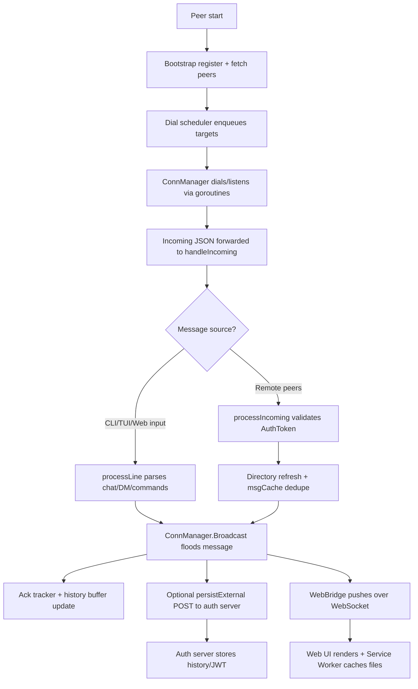

# Peer Runtime Main Execution Flow

- Nodes follow the six bullets in REPORT.md §2 “主要執行流程”.
- Decision `F` branches between local UI input and remote peer traffic, converging at the broadcast layer.
- Optional steps (persistExternal, WebBridge) illustrate the async goroutines that keep UI responsive.
